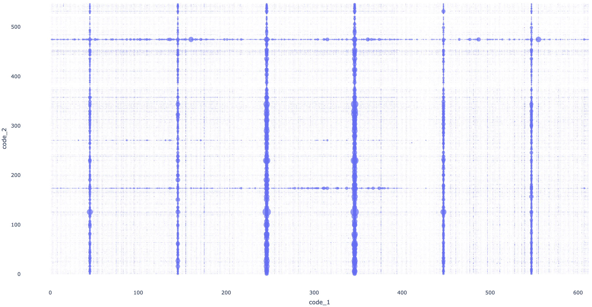

# DELT-Hit: An end-to-end computational framework for DNA-encoded chemical library analysis

## Authors

Adriano Martinelli, Alice Lessing, Garry Hoppeler, Andreas Glogger, Jörg Scheuermann

## Abstract

DNA-encoded chemical libraries (DELs) have emerged as a transformative technology in drug discovery, enabling the
simultaneous screening of millions to billions of small molecules through DNA-tag identification via high-throughput
sequencing. As outlined in the comprehensive Nature Reviews Methods Primers on this technology (Satz et al., 2022), DELs
are now employed by numerous pharmaceutical companies and academic laboratories worldwide. However, the computational
analysis of DEL screening data remains a critical bottleneck, requiring sophisticated integration of genomics,
cheminformatics, and statistical analysis workflows that are currently accessible only through proprietary or highly
specialized software solutions.

This protocol presents DELT-Hit (DNA-Encoded Library Technology Hit identification), a comprehensive open-source
computational framework that makes DEL data analysis accessible through an intuitive command-line interface to both
computational and experimental researchers. DELT-Hit is specifically designed to handle the scale and complexity of
modern industrial DEL campaigns, supporting libraries containing hundreds of millions of compounds while maintaining
computational efficiency and user accessibility.

DELT-Hit offers a complete pipeline that converts raw FASTQ reads into machine learning-ready chemical information
through five interconnected modules: (1) adaptive sequence demultiplexing using optimized RNA-seq algorithms with
DEL-specific error correction and flexible barcode handling, (2) automated chemical structure reconstruction from
building block libraries using reaction SMARTS templates with support for both single and dual display architectures, (
3) comprehensive molecular property calculation and descriptor generation using established cheminformatics libraries, (
4) statistical analysis and hit ranking with multiple normalization strategies adapted from proven RNA-seq
methodologies, and (5) integrated quality control and visualization tools specifically designed for DEL data
interpretation.

The modular architecture allows researchers to customize workflows while maintaining reproducibility through
configuration files and standardized output formats. We demonstrate the protocol's effectiveness using representative
single and dual display DEL screening datasets, showcasing the complete analysis pipeline from raw sequencing reads to
ranked lists of chemical hits with computed chemical properties and representations for downstream machine learning
tasks. The entire analysis, including quality control and visualization, can be completed within 2-6 hours on standard
computational hardware for typical datasets, making it accessible to laboratories without specialized computing
infrastructure.

DELT-Hit addresses the critical computational gap identified in the DEL field and provides the standardization necessary
for reproducible analysis across research groups. The protocol is accompanied by comprehensive documentation and
tutorial datasets with both single and dual display examples, ensuring broad adoption and consistent implementation
across the growing DEL community.

## Key Points

- **Industrial-scale capabilities**: DELT-Hit is designed to handle the computational demands of modern pharmaceutical
DEL campaigns, efficiently processing libraries containing hundreds of millions of compounds while maintaining
user-friendly operation

- **Comprehensive dual architecture support**: The framework provides native support for both single and dual display
DEL architectures, addressing the full spectrum of current library designs used in industry and academia

- **Validated algorithms**: Integrates proven bioinformatics tools (Cutadapt for sequence processing, edgeR for
statistical analysis) with specialized DEL-specific optimizations, error handling, and quality control metrics developed
through extensive validation studies

- **Flexible and robust design**: Modular architecture accommodates diverse library formats, custom reaction templates,
and building block definitions while maintaining rigorous quality control standards

- **Research-grade quality assurance**: Built-in quality control metrics, automated validation checks, and standardized
reporting ensure reliable results and facilitate systematic troubleshooting across different experimental conditions

- **Machine learning ecosystem integration**: Generates standardized, analysis-ready datasets fully compatible with
downstream machine learning workflows for advanced hit prediction, structure-activity relationship analysis, and virtual
screening applications

## Technical Overview

DELT-Hit is implemented as a Python package organized into five core modules:

**Core Analysis Modules:**

- **init**: Project initialization and configuration management with Excel template support

- **demultiplex**: Sequence processing and demultiplexing with adaptive error correction
  
  - qc: Quality control plot generation and statistical summaries
  - report: Comprehensive reporting with sequence mapping statistics

- **library**: Chemical structure reconstruction and molecular property calculation
  
  - enumerate: SMILES construction from reaction steps and building blocks
  - properties: Molecular descriptor computation and distribution visualization
  - represent: Chemical representation generation for downstream machine learning

- **dashboard**: Interactive data exploration and real-time visualization interface

- **analyse**: Statistical analysis and hit ranking with multiple enrichment methods

## Introduction

DNA-encoded chemical libraries (DELs) have revolutionized modern drug discovery by enabling the synthesis and screening
of chemical spaces that would be impractical to explore using traditional high-throughput screening approaches. In DEL
technology, each chemical compound is covalently linked to a unique DNA barcode, allowing millions to billions of
compounds to be screened simultaneously against biological targets through DNA sequencing-based identification of
enriched library members.

The computational analysis of DEL screening data presents unique challenges that require specialized approaches distinct
from conventional genomics workflows: accurate demultiplexing of complex DNA barcode combinations from sequencing reads,
reconstruction of chemical structures from building block combinations defined by reaction schemes, statistical analysis
of enrichment patterns across multiple selection conditions, and seamless integration with cheminformatics workflows for
hit optimization and structure-activity relationship analysis.

Current computational tools for DEL analysis often focus on individual workflow components rather than providing
comprehensive end-to-end solutions, require significant programming expertise for implementation, or lack the
flexibility needed to accommodate diverse library architectures and experimental designs. Most existing approaches do
not integrate well with standard bioinformatics pipelines or provide adequate quality control mechanisms for systematic
troubleshooting and result validation.

### Development of the protocol

DELT-Hit addresses these limitations through a unified, modular framework built around several key design principles:
leveraging established bioinformatics tools where appropriate while incorporating DEL-specific optimizations, providing
flexible configuration systems for diverse library designs and experimental protocols, implementing comprehensive
quality control at each analysis stage, and maintaining accessibility for users with varying computational backgrounds
through intuitive command-line interfaces and extensive documentation.

The framework integrates multiple specialized modules: sequence demultiplexing using adapted Cutadapt workflows with
DEL-optimized parameters, chemical structure reconstruction using RDKit with reaction SMARTS validation, statistical
analysis using edgeR with DEL-appropriate normalization strategies, comprehensive molecular property calculation for
drug-likeness assessment, and interactive visualization dashboards for real-time data exploration and hit
interpretation.

This modular architecture enables users to execute complete workflows for routine analysis or utilize individual
components for specialized applications, while maintaining reproducibility through standardized configuration files and
output formats. The protocol has been successfully validated across diverse DEL architectures including multi-cycle
libraries, hybridized libraries combining independent synthetic routes, and large-scale pharmaceutical screens with
millions of compounds.

### Comparison with other methods

Several academic and commercial solutions address components of the DEL informatics workflow, but few provide
comprehensive, openly available end-to-end pipelines.


**Table 1** compares DELT-Hit with representative existing methods
across key criteria including availability, scope, and performance characteristics.

| Feature              | DELT-Hit          | DELi (UNC)     | Commercial Platform A¹ | Academic Tool B² |
|----------------------|-------------------|----------------|------------------------|------------------|
| Open source          | Yes               | Yes            | No                     | Partial          |
| Complete pipeline    | Yes               | Limited        | Yes                    | No               |
| Dual display support | Yes               | No             | Yes                    | No               |
| Statistical analysis | edgeR integration | Basic counts   | Proprietary            | Custom           |
| ML-ready             | Yes               | No             | Yes                    | No               |
| Scalability          | >500M compounds   | <50M compounds | >1B compounds          | <10M compounds   |
| Documentation        | Comprehensive     | Basic          | Commercial             | Limited          |
| Cost                 | Free              | Free           | License required       | Free             |

¹Commercial platforms vary in capabilities and are not directly comparable
²Representative of specialized academic tools focusing on specific workflow components

DELT-Hit provides unique advantages in combining industrial-scale performance with open-source accessibility,
comprehensive dual architecture support, and seamless integration with machine learning workflows. Unlike commercial
solutions, DELT-Hit enables full methodological transparency and customization, while providing more complete
functionality than existing academic tools.

### Applications of the method

DELT-Hit has been successfully applied across diverse DEL screening campaigns, including target classes such as
<TODO>. The framework accommodates various library architectures
from simple two-cycle libraries to complex multi-branch synthetic schemes. Representative applications include:

- Publication 1: <TODO>
- Publication 2: <TODO>


### Limitations

While DELT-Hit addresses many challenges in DEL analysis, several limitations should be considered:

- **Computational requirements**: Memory usage and processing time scale significantly with library size and sequencing
depth, requiring high-memory systems for very large datasets (>1 billion compounds)

- **Library complexity**: Complex architectures with non-standard reaction schemes or unusual building block formats may
require custom configuration and validation

- **Error model assumptions**: Demultiplexing algorithms assume independence of sequencing errors across barcode
positions, which may not hold for all sequencing platforms

- **Chemical structure dependency**: Structure reconstruction accuracy depends on precise reaction SMARTS definitions
and building block structure quality

### Overview of the procedure

The DELT-Hit protocol is organized into five sequential stages executed through a command-line interface
designed to support both computational chemists experienced with bioinformatics tools and experimental scientists new to
DEL data analysis:

**(i) Project setup and library specification** (Steps 1-3): Configuration file creation from Excel templates, library
architecture definition, and experimental metadata specification

**(ii) Chemical structure enumeration and property calculation** (Steps 4-6): Automated SMILES generation from reaction
schemes, comprehensive molecular descriptor calculation, and chemical space visualization

**(iii) Sequence demultiplexing and quality assessment** (Steps 7-9): High-throughput sequence processing, barcode
identification with error correction, and quality control metric generation

**(iv) Statistical analysis and hit detection** (Steps 10-12): Enrichment analysis using established RNA-seq methods,
hit ranking with multiple statistical approaches, and result validation

**(v) Data visualization and interpretation** (Steps 13): Interactive dashboard exploration

The workflow supports both automated execution for
routine screening analysis and step-by-step processing for method development and troubleshooting.

## Experimental design

### Input requirements

The DELT-Hit framework processes three primary input categories, each with specific formatting requirements:

**(1) Library definition files**: Building block structures in SMILES format, reaction SMARTS templates defining
synthetic transformations, DNA constant sequences, and barcode-to-building block mapping tables. These are typically
provided in Excel format with standardized sheet names for automated parsing.

**(2) Experimental metadata**: Selection condition specifications including target proteins, control experiments,
multiplexing barcodes, and replicate groupings. This information defines the statistical comparisons and quality control
parameters for downstream analysis.

**(3) Raw sequencing data**: FASTQ files from Illumina or compatible sequencing platforms, with typical read lengths of
150-300 bp to accommodate full barcode sequences and quality scores for error correction algorithms.

### Library architecture considerations

DELT-Hit supports diverse library architectures with flexible configuration options:

**Single display libraries**: Linear synthetic schemes where DNA tags are appended after each reaction cycle, suitable
for most academic applications and focused screening campaigns.

**Dual display libraries**: Architectures where compounds are displayed on both DNA strands, enabling higher diversity.

**Multi-cycle libraries**: Complex schemes with arbitrary numbers of synthetic steps, branching reactions, and multiple
building block incorporation sites.

The framework automatically validates library architecture consistency and provides warnings for potential issues such
as incomplete reaction definitions or missing building blocks (<TOOD>).

### Library chemistry and reaction definition

Reaction cycles performed during library construction are defined through standardized SMARTS notation in user-provided
configuration files. DELT-Hit constructs a reaction graph representation that supports arbitrary reaction sequences,
branching pathways, and multiple product formation routes.

Key considerations for reaction definition:

- **SMARTS validation**: Automatic checking of reaction template syntax and chemical feasibility
- **Building block compatibility**: Verification that building blocks contain required functional groups
- **Product prediction**: Enumeration validation to ensure expected chemical structures are generated
- **Error handling**: Systematic identification and reporting of problematic reactions or building blocks

### Quality control parameters

DELT-Hit monitors comprehensive quality metrics throughout the analysis workflow:

**Demultiplexing efficiency**: Percentage of sequencing reads successfully assigned to valid barcode combinations,
typically >70% for high-quality datasets.

**Barcode recovery rates**: Coverage of each barcode to identify abnormalities in the demultiplexing.

**Statistical significance assessment**: Multiple testing correction and false discovery rate control using established
RNA-seq methodologies.

**Replicate consistency**: Correlation analysis and batch effect detection across biological and technical replicates.

**Chemical structure validation**: Automated detection of problematic structures, stereochemistry issues, and
drug-likeness assessment.

## Materials

### Equipment

**Computing hardware:**

- Minimum configuration: 8 GB RAM, 8 CPU cores, 50 GB available storage
- Recommended configuration: 32 GB RAM, 16 CPU cores, 100 GB available storage  
- High-performance setup: 64 GB RAM, 32 CPU cores, 500 GB SSD storage

**Operating systems:**

- Linux (Ubuntu 20.04+)
- macOS (12.0+)
- Windows 10/11

### Software dependencies

**Core requirements:**

- Python 3.12 or higher with pip package manager
- Conda package manager (Miniconda or Anaconda)
- R statistical computing environment (version 4.1+)
- Git version control system

**Python packages** (automatically installed):

- cutadapt (4.9+): Sequence adapter trimming and demultiplexing
- rdkit (2024.3+): Chemical structure processing and property calculation  
- pandas (2.2+): Data manipulation and statistical analysis
- numpy (1.24+): Numerical computing and array operations
- matplotlib/seaborn: Data visualization and publication-quality plotting
- plotly: Interactive visualization and dashboard components
- scipy (1.10+): Statistical functions and optimization algorithms

**R packages** (manual installation required):

- edgeR: Differential expression analysis adapted for count data
- limma: Linear modeling and empirical Bayes statistics
- tidyverse: Data manipulation and visualization tools
- BiocManager: Bioconductor package management

### Input file preparation

**Required input files:**


**Table 2 | Input file specifications and sources**

| File Type           | Format             | Description                                                 | Example Source     |
|---------------------|--------------------|-------------------------------------------------------------|--------------------|
| Campaign definition | Excel (.xlsx)      | Selection conditions, building blocks, reactions, constants | Laboratory records |
| Sequencing data     | FASTQ (.fastq/.gz) | Raw sequencing reads                                        | Illumina sequencer |

**Table 3 | Example datasets** (available for download):

| File                           | URL                                             | Description                                   |
|--------------------------------|-------------------------------------------------|-----------------------------------------------|
| NF-selection-campaign.fastq.gz | https://figshare.com/ndownloader/files/58345816 | Representative dual display screening data    |
| NF-selection-campaign.xlsx     | https://figshare.com/ndownloader/files/58345864 | Complete library and experimental definitions |

### Software installation

#### Step 1: Environment setup with Conda

We recommend using Miniconda package manager to create an isolated environment ensuring proper dependency management:

```bash
# Download and install Miniconda for your operating system
# Follow instructions at: https://docs.anaconda.com/miniconda

# Create dedicated environment
conda create -n delt-hit python=3.12 -y
conda activate delt-hit

# Install DELT-Hit package
pip install git+ssh://git@github.com/DELTechnology/delt-core.git@paper

# Verify installation
delt-hit --help
```

#### Step 2: R environment configuration

Statistical analysis components require R with specific Bioconductor packages:

```r
# Install required CRAN packages
install.packages(c("tidyverse", "GGally"))

# Install BiocManager for Bioconductor packages
if (!require("BiocManager", quietly = TRUE))
    install.packages("BiocManager")

# Install Bioconductor packages
BiocManager::install(c("edgeR", "limma"))
```

#### Step 3: Installation verification

```bash
# Activate environment
conda activate delt-hit

# Test core functionality
delt-hit init --help
```

## Procedure

### Phase 1: Project initialization and configuration • TIMING 15-45 min

The configuration file defines library structure, experimental design, and analysis parameters. DELT-Hit supports 
initialization from standardized Excel templates for user convenience.

```bash
delt-hit init --excel_path=/Users/adrianomartinelli/projects/delt/delt-core/paper/NF.xlsx
```

This command will create the `yaml` configuration file under `save_dir / name / config.yaml` as specified in the excel 
sheet.

In the next section we describe how to setup an excel file that
contains all the relevant information to construct a config file for the analysis.

#### Step 1 | Create project configuration from Excel template

The execl sheet consists of four main sections that define the experiment parameters, and library structure:

1.1 `experiment` sheet:

Create a sheet named `experiment` with the information summarized in Table 1.

**Table 1 | `experiment` configuration sheet.** Basic experiment parameters including experiment name, file paths, and
computational resources.

| Variable   | Value                                 |
|------------|---------------------------------------|
| name       | experiment-1                          |
| fastq_path | data/sequencing/NF-selection.fastq.gz |
| save_dir   | results/experiments                   |
| num_cores  | 16                                    |


1.2. `selections` sheet:

Create a sheet named `selections` with the information summarized in Table 2.
The columns S0 and S1 define the multiplexing barcodes used to identify individual selection experiments.
The minimal required information are:

  - name
  - target
  - group
  - S0
  - S1

**Table 2 | `selection` experimental design.** Multiplexing barcodes (S0, S1) identify individual selection experiments.
Groups define statistical comparisons between protein and control selections.

| name  | operator | date      | target | group      | S0     | S1        |
|-------|----------|-----------|--------|------------|--------|-----------|
| CA_N1 | A.Smith  | 15-Oct-24 | -      | no_protein | ACACAC | CGCTCGATA |
| CA_N2 | A.Smith  | 15-Oct-24 | -      | no_protein | ACAGCA | CGCTCGATA |
| CA_P1 | A.Smith  | 15-Oct-24 | hCAII  | protein    | ACGACG | CGCTCGATA |
| CA_P2 | A.Smith  | 15-Oct-24 | hCAII  | protein    | ACGCGA | CGCTCGATA |
| CA_A1 | A.Smith  | 15-Oct-24 | -      | naive      | ACGCGT | CGCTCGATA |
| CA_A2 | A.Smith  | 15-Oct-24 | -      | naive      | ACGCGG | CGCTCGATA |


1.3 `structure` sheet:

Next create a sheet named `structure` that lists the regions of your DNA constructs.
The example below defines a construct that has two selection primers (S0, S1), two constant regions (C0, C1) and two 
building block barcodes (B0, B1). For each of the regions you can define the maximum error rate tolerated during
adapter trimming.

**Table 3 | DNA sequence structure definition.** Sequence regions with error tolerance parameters for demultiplexing.
Selection barcodes require perfect matches while constant regions allow moderate error rates.

| name | type           | max_error_rate | indels |
|------|----------------|----------------|--------|
| S0   | selection      | 0              | FALSE  |
| C0   | constant       | 1.1            | TRUE   |
| B0   | building_block | 0              | FALSE  |
| C1   | constant       | 1.1            | TRUE   |
| B1   | building_block | 0              | FALSE  |
| S1   | selection      | 0              | FALSE  |


1.4 `constant` sheet:

Next create a sheet named `constant` that contains all the constant regions of your DNA constructs as shown in Table 4.
The names of the regions need to match the names defined in the `structure` sheet.


**Table 4 | Constant DNA regions definition.** 

| name | codon                   |
|------|--------------------------|
| C0   | GGAGCTTCTGAATTCTGTGTGCTG |
| C1   | CGAGTCCCATGGCGCCGGATCGACG |
| C2   | GCGTCAGGCAGC             |


#### Step 2 | Define chemical building blocks and reactions

To complete the configuration we need to define the building blocks used in the library. 
DELT-HIT supports any number of chemical building blocks. For each building block create a sheet named by the name
indicated in the `selection` sheet (e.g. B0, B1, etc.).


2.1 Building block sheets (B0, B1, etc.):

For each building block create a sheet that contains all the codons for the different building blocks as shown in 
Table 4. For each building block one needs to specify the expected codon. Users that want to be able to enumerate the 
library members and to calculate molecular properties, are required to fill in the `smiles`, `reaction`, `reactant`, and 
`product` columns as well. 

**Table 4 | Building block definition.** Chemical structures (SMILES), DNA codons, and reaction connectivity for
library enumeration.

| smiles                 | codon  | reaction | reactant   | product   |
|------------------------|--------|----------|------------|-----------|
| OC(=O)C1=CC(=CN=C1)C#C | GCCTCG | CuAAC    | scaffold_1 | product_1 |
| BrC1=NC=C(OCC#C)C=C1   | TCCGAC | CuAAC    | scaffold_1 | product_1 |
| CNC1=CC=C(OCC#C)C=C1   | CAAGTG | CuAAC    | scaffold_1 | product_1 |
| ...                    | ...    | ..       | ...        | ...       |


2.2 Reactions sheet:

_Only applies to users that want to enumerate the library members_

Create a sheet named `reactions` that contains all the reactions used during library synthesis as shown in Table 5.
This table needs to contain the reactions mentioned in the `reaction` column of the building block sheets.

**Table 5 | Reaction SMARTS templates.** Chemical transformation definitions using SMARTS notation for automated
structure enumeration.

| name  | smirks                                                    |
|-------|-----------------------------------------------------------|
| CuAAC | "[CX2:1]#[CX2;H1:2].[N:3]=[N+:4]=[N-:5]>>[C:1]1=[C:2][N-0:3][N-0:4]=[N-0:5]1" |
| Suzuki| "[cX3:1][I].[#6:2][BX3]>>[cX3:1][#6:2]"                     |


2.3 Compounds sheet:

_Only applies to users that want to enumerate the library members_

Create a sheet named `compounds` that contains all other compounds used during library synthesis as shown in Table 6.


**Table 6 | Compounds SMILES.** Other compounds used in chemical reactions other than the building blocks.

| name        | smiles                                        |
|-------------|-----------------------------------------------|
| scaffold_1  | Ic1ccc(CC(N=[N+]=[N-])C(O)=O)cc1              |
| scaffold_2  | [N-]=[N+]=NC(C(O)=O)Cc1cc(I)ccc1              |
| scaffold_3  | [N-]=[N+]=NC(C(O)=O)Cc1c(I)cccc1              |
| scaffold_4  | NC(Cc1ccc(I)cc1)C(=O)O                        |
| scaffold_5  | NC(Cc1cccc(I)c1)C(=O)O                        |
| scaffold_6  | NC(Cc1ccccc1I)C(=O)O                          |


### Phase 2: Chemical library enumeration and analysis • TIMING 10 min - 2 h

#### Step 4 | Enumerate library compounds from building blocks

```bash
delt-hit library enumerate --config_path=/Users/adrianomartinelli/projects/delt/delt-core/paper/experiment-3/config.yaml
```

This process generates all possible chemical structures from building block combinations according to defined reaction
schemes.

**Expected outputs:**

- `library.parquet`: Complete compound catalog with SMILES and barcode mappings
- `reaction_graph.png`: Visual representation of synthetic scheme

**Figure 6 | Reaction graph visualization.** Automated generation of synthetic scheme diagrams showing building block
incorporation and reaction connectivity. Nodes represent chemical intermediates, edges represent transformations.


#### Step 5 | Calculate molecular properties and descriptors

```bash
# ~1000 compounds/s
delt-hit library properties --config_path=/Users/adrianomartinelli/projects/delt/delt-core/paper/experiment-3/config.yaml
```

Comprehensive molecular descriptor calculation using RDKit for drug-likeness assessment and chemical space
characterization.

**Computed properties include:**

- Lipinski descriptors (MW, LogP, HBD, HBA)
- Topological indices (TPSA, rotatable bonds)
- Structural complexity metrics
- Pharmacophore features


#### Step 6 | Generate molecular representations for machine learning

```bash
# Morgan fingerprints for similarity analysis
# ~600 - 1000 compounds/s
delt-hit library represent --method=morgan --config_path=/Users/adrianomartinelli/projects/delt/delt-core/paper/experiment-3/config.yaml

# BERT embeddings for deep learning applications  
# ~600 - 1000 compounds/s
delt-hit library represent --method=bert --config_path=/Users/adrianomartinelli/projects/delt/delt-core/paper/experiment-3/config.yaml
```

Creates standardized chemical representations compatible with scikit-learn and deep learning frameworks.

### Phase 3: Sequence processing and demultiplexing • TIMING 30 min - 4 h

#### Step 7 | Configure demultiplexing parameters

Optimize sequence processing parameters based on sequencing quality and library design:

```yaml
# Edit config.yaml structure section
structure:
  S0:
    type: selection
    max_error_rate: 0.0    # Perfect match required for multiplexing barcodes
    indels: false
  C0:
    type: constant
    max_error_rate: 1.01   # Allow moderate errors in constant regions
    indels: true
  B0:
    type: building_block
    max_error_rate: 0
    indels: false
```

#### Step 8 | Create & Execute sequence demultiplexing

Cutadapt is used to perform demultiplexing of the sequencing files. The following command prepares the cutadapt input 
files and bash script for execution that users can adapt to their specific use cases if needed.

The script performs the following steps:

1. **Adapter detection and trimming**: Removal of sequencing adapters and primers
2. **Barcode extraction**: Identification of building block and selection barcodes
3. **Count aggregation**: Tabulation of reads per compound per selection

```bash
delt-hit demultiplex prepare --config_path=/Users/adrianomartinelli/projects/delt/delt-core/paper/experiment-3/config.yaml
# run demultiplexing script
chmod u+x /Users/adrianomartinelli/projects/delt/delt-core/paper/experiment-3/demultiplex/cutadapt_input_files/demultiplex.sh
/Users/adrianomartinelli/projects/delt/delt-core/paper/experiment-3/demultiplex/cutadapt_input_files/demultiplex.sh
```

#### Step 9 | Generate quality control reports and visualizations

In the next step we assess the quality of the demultiplexing. This includes

- Barcode recovery statistics
- Error rate distributions

```bash
# Comprehensive processing statistics
delt-hit demultiplex report --config_path=/Users/adrianomartinelli/projects/delt/delt-core/paper/experiment-3/config.yaml

# Quality control visualizations
delt-hit demultiplex qc --config_path=/Users/adrianomartinelli/projects/delt/delt-core/paper/experiment-3/config.yaml
```

**Figure 8 | Demultiplexing quality control report.** Representative quality metrics showing successful sequence
processing with >75% read retention and even barcode distribution.


### Phase 4: Statistical analysis and hit identification • TIMING 10-30 min

Statistical comparison groups are defined based on experimental design, typically comparing protein selections against
no-protein controls.

#### Step 11 | Perform enrichment analysis with multiple methods

To perform the enrichment analysis the user needs to define the selections to compare. Along with the `group` information
provided in the `selections` section of the configuration the analysis scripts will produce `R` scripts to compute 
enrichment statistics. Currently DELT-Hit supports two statistical approaches: edgeR and a simple counts method.
While edgeR - a well established method in the single-cell community to detect differentialy expressed genes - is more 
sensitive it requires replicates of the same selection condition. In contrast the simple counts methods can be used with
just a single selection against protein and no-protein controls.

```yaml
# Add the `analyses` section in the config.yaml
analyses:
  analysis-1:
    selections:
      - AG24_1
      - AG24_2
      - AG24_3
      - AG24_10
      - AG24_11
      - AG24_12

  analysis-2:
    selections:
      - AG24_1
      - AG24_2
      - AG24_3
      - AG24_19
      - AG24_20
      - AG24_21
```

**Statistical approaches:**

- **edgeR method**: Sophisticated RNA-seq-derived statistical model with empirical Bayes shrinkage
- **Counts method**: Simple fold-change calculation suitable for initial screening

Generate the R scripts for the statistical analysis by running:

```bash
delt-hit analyse enrichment \
--config_path=/Users/adrianomartinelli/projects/delt/delt-core/paper/experiment-3/config.yaml \
--name=analysis-1 \
--method=counts

# run the generated R script
Rscript --vanilla /Users/adrianomartinelli/projects/delt/delt-core/paper/experiment-3/analyses/analysis-1/counts/enrichment_counts.R

delt-hit analyse enrichment \
--config_path=/Users/adrianomartinelli/projects/delt/delt-core/paper/experiment-3/config.yaml \
--name=analysis-1 \
--method=edgeR

# run the generated R script
Rscript --vanilla /Users/adrianomartinelli/projects/delt/delt-core/paper/experiment-3/analyses/analysis-1/edgeR/enrichment_edgeR.R

```


#### Step 12 | Rank hits and generate final output tables

Results are automatically ranked by statistical significance and fold-change metrics:

**Output files:**
- `stats.csv`: Complete hit list with statistics and chemical properties
- `hits.csv`: Statistical significance compounds.
- additional, method specific files like normalized counts.


**Table 3 | Example hit ranking output**

| code_1 | code_2 | LogFC | FDR  | LogP |
|--------|--------|-------|------|------|
| 24     | 427    | 4.2   | 1e-8 | 2.1  |
| 104    | 205    | 3.8   | 2e-7 | 1.9  |

**Figure 9 | Hit ranking table legend.** LogFC: log2 fold-change vs controls; FDR: false discovery rate corrected
p-value; LogP: partition coefficient;

### Phase 5: Data visualization and interpretation • TIMING 15-60 min

#### Step 13 | Launch interactive analysis dashboard

In the last step we can visualize the raw counts from the demultiplexing step. For this the user needs to provide the
path to the counts file generated during demultiplexing along with the path to the configuration file.

```bash
delt-hit dashboard --config_path=/Users/adrianomartinelli/projects/delt/delt-core/paper/experiment-3/config.yaml \
                   --counts_path=/Users/adrianomartinelli/projects/delt/delt-core/paper/experiment-3/selections/AG24_10/counts.txt
```

Opens web-based interface (typically http://localhost:8050) providing:

- Selection and experiment parameters
- Hit exploration with extensive filter capabilities


**Figure 9 | Dashboard visualization.**




## Troubleshooting

**Table 4 | Common issues and solutions**

| Problem                              | Possible Cause                                | Solution                                                       |
|--------------------------------------|-----------------------------------------------|----------------------------------------------------------------|
| Low demultiplexing efficiency (<50%) | High error rates, incorrect barcode sequences | Increase max_error_rate parameters; validate barcode sequences |
| Memory errors during enumeration     | Large library size, insufficient RAM          | Reduce library size or use high-memory system (>32 GB)         |
| R integration failures               | Missing R packages, PATH issues               | Reinstall R packages; verify R installation path               |
| Empty hit lists                      | Stringent statistical thresholds              | Adjust FDR cutoffs; check replicate consistency                |
| Chemical structure errors            | Invalid SMILES, incorrect reaction SMARTS     | Validate building block structures; check reaction definitions |

**Performance optimization guidelines:**

- **Small libraries** (<1M compounds): 8+ GB RAM recommended  
- **Medium libraries** (1-50M compounds): 8+ GB RAM recommended  
- **Large libraries** (>50M compounds): 16+ GB RAM
- **Very large libraries** (>500M compounds): High-performance computing recommended

**Quality control thresholds:**

- **Demultiplexing efficiency**: >70% expected for high-quality data
- **Library coverage**: 10-90% depending on selection stringency
- **Replicate correlation**: R² >0.7 between biological replicates
- **Statistical power**: >100 reads per compound for reliable statistics

## Timing

Protocol execution times depend on dataset characteristics and computational resources:

**Table 5 | Timing estimates for different dataset sizes**

| Analysis Phase          | Small Dataset¹   | Medium Dataset² | Large Dataset³ |
|-------------------------|------------------|-----------------|----------------|
| Environment setup       | 15-30 min        | 15-30 min       | 15-30 min      |
| Project initialization  | 5-10 min         | 10-15 min       | 15-30 min      |
| Library enumeration     | 2-5 min          | 15-45 min       | 1-2 h          |
| Property calculation    | 1-3 min          | 10-30 min       | 30 min-1 h     |
| Sequence demultiplexing | 10-30 min        | 1-2 h           | 2-6 h          |
| Statistical analysis    | 2-5 min          | 5-15 min        | 15-45 min      |
| Visualization           | 5-15 min         | 10-30 min       | 15-45 min      |
| **Total workflow time** | **45 min-1.5 h** | **2-4 h**       | **4-8 h**      |

¹Small: <100K compounds, <10M reads
²Medium: 100K-10M compounds, 10-100M reads  
³Large: >10M compounds, >100M reads

## Anticipated results

### Output file structure

DELT-Hit generates a comprehensive, standardized output hierarchy:

```
# project_name/
#    config.yaml  # Master configuration
#    library.parquet  # chemical compounds with properties
#    ...
```

### Chemical library characterization

**Library enumeration generates:**

- **Complete structure catalog**: All possible compounds with canonical SMILES representation
- **Molecular property distributions**: Comprehensive descriptor analysis for drug-likeness assessment  
- **Chemical space visualization**: Principal component analysis and diversity metrics
- **Reaction validation**: Automated checking of synthetic feasibility and structure quality

**Expected library characteristics:**

For a representative 2-cycle DEL with 1000 building blocks per position:

- **Library size**: ~1 million unique structures
- **Molecular weight range**: 200-800 Da (pharmaceutically relevant)
- **Chemical diversity**: Tanimoto similarity <0.4 between randomly selected pairs
- **Drug-likeness**: 70-90% compounds passing Lipinski's Rule of Five
- **Structural complexity**: Mean heavy atom count 15-35 atoms

### Sequence processing performance

**Successful demultiplexing produces:**

- **Read retention**: 60-85% of input reads assigned to valid barcode combinations
- **Library coverage**: 10-90% of theoretical compounds detected depending on selection stringency
- **Error correction**: <5% sequencing errors per barcode position after quality filtering
- **Multiplexing efficiency**: >95% correct assignment of reads to selection conditions


**Table 6 | Expected demultiplexing performance metrics**

| Metric                  | Excellent | Good   | Acceptable | Poor |
|-------------------------|-----------|--------|------------|------|
| Initial read retention  | >90%      | 80-90% | 70-80%     | <70% |
| Barcode assignment      | >85%      | 75-85% | 60-75%     | <60% |
| Library coverage        | >50%      | 30-50% | 10-30%     | <10% |
| Error rate per position | <2%       | 2-5%   | 5-10%      | >10% |

**Figure 10 | Demultiplexing performance metrics legend.** Quality thresholds for systematic evaluation of sequence
processing success. Poor performance typically indicates technical issues requiring troubleshooting.

### Statistical analysis outputs

**Hit identification provides:**

- **Statistical significance assessment**: False discovery rate controlled p-values using established RNA-seq
methodologies
- **Effect size quantification**: Log2 fold-change measurements with confidence intervals
- **Multiple comparison correction**: Benjamini-Hochberg FDR control across all library members
- **Quality validation**: Replicate consistency analysis and batch effect assessment

**Expected enrichment patterns:**

- **Hit rates**: 0.1-2% of library members showing significant enrichment (FDR < 0.05)
- **Dynamic range**: 2-1000 fold enrichment over negative controls
- **Replicate consistency**: Pearson correlation R > 0.7 between biological replicates
- **Statistical power**: Reliable detection of >2-fold enrichment with >100 reads per compound


**Table 7 | Representative statistical analysis results**

| Analysis Type     | Hits Identified¹ | Median LogFC² | FDR Threshold | Replicate Correlation |
|-------------------|------------------|---------------|---------------|-----------------------|
| Enzyme target     | 156 (0.15%)      | 3.2           | 0.05          | 0.82                  |
| PPI disruption    | 89 (0.09%)       | 4.1           | 0.01          | 0.79                  |
| Membrane receptor | 234 (0.23%)      | 2.8           | 0.05          | 0.85                  |

¹Number and percentage of library members with significant enrichment
²Log2 fold-change for significantly enriched compounds

### Integration capabilities and downstream applications

**DELT-Hit outputs integrate seamlessly with:**

**Machine learning workflows:**

- **Scikit-learn compatibility**: Standardized feature matrices for classification and regression
- **Deep learning frameworks**: TensorFlow and PyTorch compatible data loaders
- **Chemical informatics**: RDKit integration for advanced molecular modeling
- **Statistical analysis**: Direct export to R for specialized statistical modeling

**Cheminformatics pipelines:**

- **Structure-activity relationships**: Automated SAR analysis with statistical validation  
- **Virtual screening**: Chemical similarity search and pharmacophore modeling
- **Lead optimization**: Multi-parameter optimization with ADMET prediction
- **Chemical space analysis**: Principal component analysis and clustering methods

### Quality assurance and validation

**Built-in validation features:**

- **Chemical structure verification**: Automated detection of invalid SMILES and stereochemistry issues
- **Reaction template validation**: Verification of SMARTS syntax and chemical feasibility  
- **Statistical model diagnostics**: Residual analysis and model assumption checking
- **Cross-platform reproducibility**: Consistent results across different computing environments

**Expected validation outcomes:**

- **Structure enumeration**: >99.5% valid chemical structures generated
- **Reaction template accuracy**: Automated detection of problematic transformations
- **Statistical model fit**: Residual plots showing appropriate dispersion characteristics
- **Reproducibility**: <5% coefficient of variation between independent analyses

## Data and code availability

### Software access and documentation

**DELT-Hit software is freely available under MIT License:**

- **Primary repository**: https://github.com/DELTechnology/delt-hit
- **Documentation**: Comprehensive user guides, API reference, and tutorials
- **Issue tracking**: Community support and bug reporting system
- **Continuous integration**: Automated testing across multiple platforms

## Author contributions

A.M. conceived the project, designed the software architecture, and implemented core algorithms in collaboration with G.H.
A.L. created and maintained the configuration files. A.G. performed selection experiments and help performed the results interpretation.
J.S. provided scientific
oversight. All authors contributed to manuscript preparation and revision.

## Competing interests

The authors declare no competing financial interests.

## Acknowledgments

We thank the DEL research community for valuable feedback during software development and beta testing. We acknowledge
the developers of Cutadapt, RDKit, edgeR, and other open-source tools that enable this framework. Special thanks to
early adopters who provided critical feedback for improving usability and robustness.

## References

1. Satz, A. L. et al. DNA-encoded chemical libraries. *Nat. Rev. Methods Primers* **2**, 2 (2022).

2. Goodnow, R. A., Dumelin, C. E. & Keefe, A. D. DNA-encoded chemistry: enabling the deeper sampling of chemical space.
   *Nat. Rev. Drug Discov.* **16**, 131–147 (2017).

3. Brenner, S. & Lerner, R. A. Encoded combinatorial chemistry. *Proc. Natl. Acad. Sci. USA* **89**, 5381–5383 (1992).

4. Franzini, R. M. & Randolph, C. Chemical space of DNA-encoded libraries. *J. Med. Chem.* **59**, 6629–6644 (2016).

5. Robinson, M. D., McCarthy, D. J. & Smyth, G. K. edgeR: a Bioconductor package for differential expression analysis of
   digital gene expression data. *Bioinformatics* **26**, 139–140 (2010).

6. Martin, M. Cutadapt removes adapter sequences from high-throughput sequencing reads. *EMBnet J.* **17**, 10–12 (
   2011).

7. Landrum, G. et al. RDKit: Open-source cheminformatics. https://www.rdkit.org (2023).

8. McInnes, C. DNA-encoded library strategies for drug discovery. *Curr. Opin. Chem. Biol.* **26**, 77–83 (2015).

9. Machutta, C. A. et al. Prioritizing multiple therapeutic targets in parallel using automated DNA-encoded library
   screening. *Nat. Commun.* **13**, 6742 (2022).

10. Bigatti, M. et al. Impact of library design on the quality of hits identified from DNA-encoded chemical libraries.
    *ACS Comb. Sci.* **23**, 309–321 (2021).