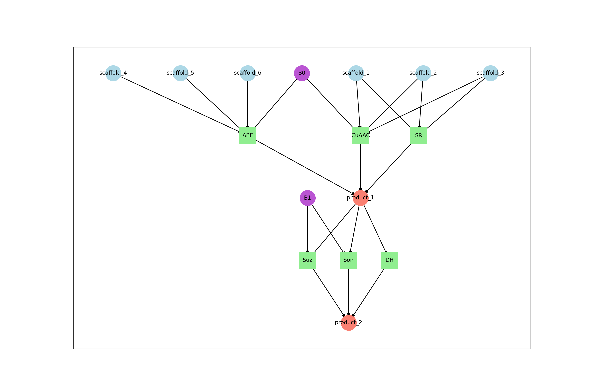
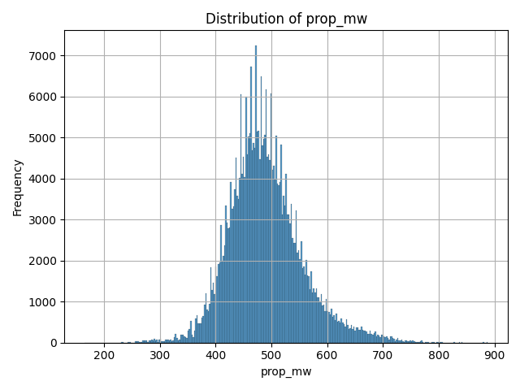

# Title: DELT-Hit: An end-to-end computational framework for DNA-encoded chemical library analysis

## Authors

Adriano Martinelli, Alice Lessing, Garry Hoppeler, Andreas Glogger, Jörg Scheuermann

## Abstract

DNA-encoded chemical libraries (DELs) have revolutionized drug discovery by enabling the simultaneous screening of
millions to billions of small molecules through DNA-tag identification via high-throughput sequencing. As outlined in
the comprehensive Nature Reviews Methods Primers on this technology (Satz et al., 2022), DELs are now employed by
numerous pharmaceutical companies and academic laboratories worldwide. However, the computational analysis of DEL
screening data remains a critical bottleneck, requiring sophisticated integration of genomics, cheminformatics, and
statistical analysis workflows that are currently accessible only through proprietary or highly specialized software
solutions.
This protocol presents DELT-Hit (DNA-Encoded Library Technology Hit), a comprehensive open-source computational
framework that makes DEL data analysis accessible through an intuitive command-line interface to both computational and
experimental researchers. DELT-Hit is specifically designed to handle the scale and complexity of modern industrial DEL
campaigns, supporting libraries containing hundreds of millions of compounds while maintaining computational efficiency
and user accessibility.
DELT-Hit offers a complete pipeline that converts raw FASTQ reads into machine learning ready chemical information
through five connected modules: (1) adaptive sequence demultiplexing using optimized RNA-seq algorithms with
DEL-specific error correction and flexible barcode handling, (2) automated chemical structure reconstruction from
building block libraries using reaction SMARTS templates with support for both single and dual display architectures,
(3) comprehensive molecular property calculation and descriptor generation using established cheminformatics libraries,
(4) statistical analysis and hit ranking with multiple normalization strategies adapted from proven RNA-seq
methodologies, and (5) integrated quality control and visualization tools specifically designed for DEL data
interpretation.
The modular architecture allows researchers to customize workflows while maintaining reproducibility through
configuration files and standardized output formats. We demonstrate the protocol's effectiveness using representative
single and dual display DEL screening datasets, showcasing the complete analysis pipeline from raw sequencing reads
to
ranked lists of chemical hits with computed chemical properties and representations for downstream machine learning
tasks. The entire analysis, including quality control and visualization, can be completed within 4-6 hours on
standard
computational hardware for typical datasets, making it accessible to laboratories without specialized computing
infrastructure.
DELT-Hit addresses the critical computational gap identified in the DEL field and provides the standardization
necessary
for reproducible analysis across research groups. The protocol is accompanied by comprehensive documentation,
tutorial
datasets with both single and dual display examples, ensuring broad adoption and consistent implementation across the
growing DEL community.

## Key Points

- Industrial-scale capabilities: DELT-Hit is designed to handle the computational demands of modern pharmaceutical DEL
  campaigns, efficiently processing libraries containing hundreds of millions of compounds while maintaining
  user-friendly
  operation
- Comprehensive dual architecture support: The framework provides native support for both single and dual display DEL
  architectures, addressing the full spectrum of current library designs used in industry and academia
- Validated algorithms: Integrates proven bioinformatics tools (Cutadapt for sequence processing, edgeR for statistical
  analysis) with specialized DEL-specific optimizations, error handling, and quality control metrics developed through
  extensive validation studies
- Flexible and robust design: Modular architecture accommodates diverse library formats, custom reaction templates, and
  building block definitions
- Research-grade quality assurance: Built-in quality control metrics, automated validation checks, and standardized
  reporting ensure reliable results and facilitate systematic troubleshooting across different experimental conditions
- Machine learning ecosystem integration: Generates standardized, analysis-ready datasets fully compatible with
  downstream machine learning workflows for advanced hit prediction, structure-activity relationship analysis, and
  virtual
  screening applications

## Technical Overview

DELT-Hit is implemented as a Python package organized into five modules:

## Core Analysis Modules:

- init: Project initialization and configuration management
- demultiplex: Sequence processing and demultiplexing with adaptive error correction
    - qc: produce quality control plots
    - report: produce report with statistics about mapped sequences
- library: Chemical structure reconstruction and molecular property calculation
    - enumerate: construct smiles from reaction steps
    - properties: compute and visualize distribution of chemical properties
    - represent: compute SMILES representations for downstream tasks
- dashboard: interactive data exploration and visualization
- analyse: Statistical analysis and hit ranking

## Introduction

DNA-encoded chemical libraries (DECLs) have emerged as a powerful technology in drug discovery, enabling the synthesis
and screening of vast chemical spaces that would be impractical to explore using traditional approaches. In DECL
technology, each chemical compound is covalently linked to a unique DNA barcode, allowing millions to billions of
compounds to be screened simultaneously against biological targets through DNA sequencing-based identification.
The computational analysis of DECL screening data presents unique challenges that require specialized approaches:
accurate demultiplexing of complex DNA barcode combinations from sequencing reads, reconstruction of chemical structures
from building block combinations, statistical analysis of enrichment patterns, and integration with cheminformatics
workflows for hit optimization.
Current computational tools for DECL analysis often focus on individual workflow components rather than providing
comprehensive solutions, require significant programming expertise, or lack flexibility for diverse library
architectures. Most existing approaches do not integrate well with standard bioinformatics pipelines or provide adequate
quality control mechanisms.

### Development of the protocol

DELT-Core addresses these limitations through a unified, modular framework built around several key design principles:
leveraging established bioinformatics tools where appropriate, providing flexible configuration for diverse library
designs, implementing comprehensive quality control, and maintaining accessibility for users with varying computational
backgrounds.
The framework consists of integrated modules: demultiplexing using adapted Cutadapt workflows, chemical structure
reconstruction with RDKit, statistical analysis with edgeR, molecular property calculation, and interactive
visualization dashboards. This modular architecture enables users to execute complete workflows or use individual
components as needed.
The protocol has been successfully applied to analyze diverse DECL architectures including multi-cycle libraries,
hybridized libraries combining independent synthetic routes, and large-scale screens with millions of compounds. The
framework's flexibility allows adaptation to novel experimental protocols with minimal code modification.

### Comparison with other methods

A number of academic and commercial solutions address parts of the DEL informatics workflow, but few provide an
end-to-end, openly available pipeline. DELT-Hit is most comparable in scope to recent academic offerings such as DELi (
UNC), while also integrating component tools that specialize in key problem areas (e.g., demultiplexing with Cutadapt,
enrichment modeling with edgeR). Below we contrast DELT-Hit against representative methods across availability,
scope/functionality, and performance/scalability.

### Applications of the method

TODO: Add selected papers from group.

### Limitations

- Computational requirements scale significantly with library size and sequencing depth
- Complex library architectures with non-standard reaction schemes may require customization
- Demultiplexing assumes independence of errors across barcode positions
- Chemical structure reconstruction depends on accurate reaction SMARTS definitions
- Very large datasets may require high-memory computing resources or distributed processing

### Overview of the procedure

The protocol is organized into five core stages, carried out through a collaborative command-line interface:
(i) project setup and library specification,
(ii) chemical structure enumeration and property calculation,
(iii) sequence demultiplexing and quality assessment,
(iv) statistical analysis and hit detection, and
(v) data visualization and interpretation.

The workflow is designed to support both computational chemists experienced with digital tools and wet-lab scientists. Each stage integrates thorough quality control measures and produces standardized outputs that can be readily used in downstream analyses.

## Experimental design

### Input requirements

The framework processes three primary input types: (1) library definition files containing building block structures,
reaction SMARTS, and constant sequences; (2) experimental metadata specifying selection conditions and sample
identifiers; and (3) raw FASTQ files from high-throughput sequencing platforms.

### Library architecture considerations

The framework supports diverse library architectures with arbitrary number of reaction cycles
and commonly used single/dual-display library architectures.

### Library chemistry

The reaction cycles performed during library construction are defined by the user through a simple configuration file that indicates the different reactions steps.
From this information, DELT-Hit builds a reaction graph representation that supports arbitrary reaction sequences and branching.

### Quality control parameters

Key quality metrics monitored throughout the workflow:

- Demultiplexing efficiency and barcode recovery rates
- Sequencing quality scores and adapter matching statistics
- Statistical significance of enrichment patterns

## Materials

### Hardware:

- Minimum: 8 GB RAM, 8 CPU cores, 30 GB storage
- Recommended: 16 GB RAM, 32 CPU cores, 30 GB storage

### Operating system:

- Linux (Ubuntu 22.04+), macOS (12.0+), or Windows

### Software

- Python 3.10 or higher with conda package manager or virtual environment
- cutadapt (4.9+): Sequence adapter trimming and demultiplexing
- rdkit (2024.3+): Chemical structure processing and property calculation
- pandas (2.2+): Data manipulation and analysis
- matplotlib/seaborn: Data visualization and plotting
- edgeR (via R): Statistical analysis of count data

### File Preparation

1. Sequencing file in formats compatible with cutadapt (<TODO: list formats />)
2. Configuration file

### Setup

#### 1. Conda

We recommend using the [Miniconda](https://docs.anaconda.com/miniconda) package manager to create an isolated
environment for this project. This ensures that all dependencies are managed correctly.

- [Download and install Miniconda](https://docs.anaconda.com/miniconda#latest-miniconda-installer-links) for your
  operating system.
- After installation, you should be able to use the `conda` command in your terminal.
    ```bash
    conda create -n del python=3.11 -y
    conda activate del
    # Always activate this environment (`conda activate del`) before using `delt-core`.
    pip install git+https://github.com/DELTechnology/delt-core.git
    delt-cli --help
    # You should see a list of available commands.
    ```

#### 2. R Environment

Some analysis features in `delt-core` (like enrichment analysis with `edgeR`) depend on R.

- **Install R:** Download and install R from the [Comprehensive R Archive Network (CRAN)](https://cran.r-project.org/).
- **Install R Packages:** Once R is installed, open an R console and run the following commands to install the required
  packages:
    ```R
    # Install tidyverse and GGally from CRAN
    install.packages(c("tidyverse", "GGally"))

    # Install BiocManager
    if (!require("BiocManager", quietly = TRUE))
        install.packages("BiocManager")

    # Install edgeR and limma from Bioconductor
    BiocManager::install(c("edgeR", "limma"))
    ```

## Procedures

1. Create configuration file

Timing: 30 minutes - 8h

- Experiment section

| variable   | value                                                                            |
|------------|----------------------------------------------------------------------------------|
| name       | test-1                                                                           |
| fastq_path | ~/data/DECLT-DB/fastq_files/368061_1-241105_AG_BZ_NC_pool1_NF_S3_R1_001.fastq.gz |
| save_dir   | ~/data/DECLT-DB/experiments                                                      |
| num_cores  | 10                                                                               |

- Selections section

| name    | operator  | date      | target               | group      | beads           | info | blocking | buffer | protocol | S0     | S1        |
|---------|-----------|-----------|----------------------|------------|-----------------|------|----------|--------|----------|--------|-----------|
| AG24_1  | A. Gloger | 26-Sep-24 | No Protein           | no_protein | Dynabeads SA C1 | -    | Biotin   | PBS-T  | DECL_5W  | ACACAC | CGCTCGATA |
| AG24_2  | A. Gloger | 26-Sep-24 | No Protein           | no_protein | Dynabeads SA C1 | -    | Biotin   | PBS-T  | DECL_5W  | ACAGCA | CGCTCGATA |
| AG24_3  | A. Gloger | 26-Sep-24 | No Protein           | no_protein | Dynabeads SA C1 | -    | Biotin   | PBS-T  | DECL_5W  | ACATGT | CGCTCGATA |
| AG24_10 | A. Gloger | 26-Sep-24 | hCAII-Avi-His (biot) | protein    | Dynabeads SA C1 | -    | Biotin   | PBS-T  | DECL_5W  | ACGACG | CGCTCGATA |
| AG24_11 | A. Gloger | 26-Sep-24 | hCAII-Avi-His (biot) | protein    | Dynabeads SA C1 | -    | Biotin   | PBS-T  | DECL_5W  | ACGCGA | CGCTCGATA |
| AG24_12 | A. Gloger | 26-Sep-24 | hCAII-Avi-His (biot) | protein    | Dynabeads SA C1 | -    | Biotin   | PBS-T  | DECL_5W  | ACTAGC | CGCTCGATA |
| AG24_19 | A. Gloger | 26-Sep-24 | USP-13 (biot.)       | naive      | Dynabeads SA C1 | -    | Biotin   | PBS-T  | DECL_5W  | ACTCTG | CGCTCGATA |
| AG24_20 | A. Gloger | 26-Sep-24 | USP-13 (biot.)       | naive      | Dynabeads SA C1 | -    | Biotin   | PBS-T  | DECL_5W  | ACTGAT | CGCTCGATA |
| AG24_21 | A. Gloger | 26-Sep-24 | USP-13 (biot.)       | naive      | Dynabeads SA C1 | -    | Biotin   | PBS-T  | DECL_5W  | AGACTA | CGCTCGATA |

- Structure section

| name | type           | max_error_rate | indels |
|------|----------------|----------------|--------|
| S0   | selection      | 0              | FALSE  |
| C0   | constant       | 0              | FALSE  |
| B0   | building_block | 0              | FALSE  |
| C1   | constant       | 0              | FALSE  |
| B1   | building_block | 0              | FALSE  |
| C2   | constant       | 0              | FALSE  |
| S1   | selection      | 0              | FALSE  |

- Compounds section

| name       | smiles                           |
|------------|----------------------------------|
| scaffold_1 | Ic1ccc(CC(N=[N+]=[N-])C(O)=O)cc1 |
| scaffold_2 | [N-]=[N+]=NC(C(O)=O)Cc1cc(I)ccc1 |

- Reactions section

| name  | smirks                                                               |
|-------|----------------------------------------------------------------------|
| ABF   | `[CX3:1](=[O:2])[OX2;H1].[N;H2:4]>>[CX3:1](=[O:2])[N;H:4]`           |
| SR    | `[#6:1][$([NX2-][NX2+]#[NX1]),$([NX2]=[NX2+]=[NX1-])]>>[#6:1][N;H2]` |
| CuAAC | `[CX2:1]#[CX2:2].[N:3]=[N+:4]=[N-:5]>>[C:1]1=[C:2][N:3][N:4]=[N:5]1` |
| Suz   | `[cX3:1][I].[#6:2][BX3]>>[cX3:1][#6:2]`                              |

- Constant section

| name | codon                     |
|------|---------------------------|
| C0   | GGAGCTTCTGAATTCTGTGTGCTG  |
| C1   | CGAGTCCCATGGCGCCGGATCGACG |
| C2   | GCGTCAGGCAGC              |

- Building block 0 section

| smiles                 | codon  | reaction | reactant   | product   |
|------------------------|--------|----------|------------|-----------|
| OC(=O)C1=CC(=CN=C1)C#C | GCCTCG | CuAAC    | scaffold_1 | product_1 |
| BrC1=NC=C(OCC#C)C=C1   | TCCGAC | CuAAC    | scaffold_1 | product_1 |
| CNC1=CC=C(OCC#C)C=C1   | CAAGTG | CuAAC    | scaffold_1 | product_1 |
| NC(=O)C1=CC(=CN=C1)C#C | GTCCGC | CuAAC    | scaffold_1 | product_1 |
| O=C(NCC#C)NC1CC1       | GACGAC | CuAAC    | scaffold_1 | product_1 |

- Building block 1 section

| smiles               | codon   | reaction | reactant  | product   |
|----------------------|---------|----------|-----------|-----------|
| OB(O)c1cc(ccc1Cl)C#N | GTCTCAC | Suz      | product_1 | product_2 |
| COc1ccc(B(O)O)c(F)c1 | GTCGTAC | Suz      | product_1 | product_2 |
| O.Nc1cccc(c1)B(O)O   | CTCATTG | Suz      | product_1 | product_2 |
| Cc1cc(ccc1F)B(O)O    | GTAGAGA | Suz      | product_1 | product_2 |
| COc1ccc(cc1)B(O)O    | GTTACCT | Suz      | product_1 | product_2 |

To facilitate the initialization of the configuration files, this information can be read in from an excel file with
sheets that have the corresponding names and then converted to a config.yaml with the command

```bash
delt-cli init --excel_path=path/to/library.xlsx`
```

2. Enumerate library compounds:

Timing: 5 minutes - 2h

```bash
delt-cli library enumerate --config_path=config.yaml
```

This will create the following files in the `save_dir / name` folder:

- `library.parquet`: contains a column SMILES and the codon indices for each of the compounds.
- `reaction_graph.png`: a graphical representation of the reaction steps defined in the configuration file.



4. Calculate molecular properties: Computes comprehensive molecular descriptors including drug-likeness metrics,
   physical properties, and structural features.
   ```bash
    delt-cli library properties --config_path=config.yaml
   ```



3. Define demultiplexing parameters: Configure the `structure` section of the config.yaml to enable demultiplexing with
   region specific error rates or allowing indels. Refer to the cutadapt documentation to learn more about calibration
   of the error rate.

9. **Generate molecular representations** (optional)
   ```bash
   # Morgan fingerprints for similarity analysis
   delt-cli library represent --method=morgan --config_path=config.yaml
   
   # BERT embeddings for machine learning applications
   delt-cli library represent --method=bert --config_path=config.yaml
   ```

### Sequence demultiplexing and processing • TIMING 30 min - 4 hours

10. **Execute demultiplexing workflow**
    ```bash
    delt-cli demultiplex run --config_path=config.yaml
    ```
    This performs sequential adapter trimming and barcode identification using optimized Cutadapt workflows.

11. **Generate quality control reports**
    ```bash
    delt-cli demultiplex report --config_path=config.yaml
    delt-cli demultiplex qc --config_path=config.yaml
    ```


[hits_0-S0.pdf](experiment-1/qc/hits_0-S0.pdf)

### Statistical analysis and hit identification • TIMING 10-30 min

12. **Define analysis groups**
    ```bash
    # Add target protein selections
    delt-cli analyse add --config_path=config.yaml \
                         --name=target_analysis \
                         --selections='["selection_1", "selection_2", "selection_3"]'
    ```

13. **Perform enrichment analysis**
    ```bash
    # Statistical analysis using edgeR
    delt-cli analyse enrichment --config_path=config.yaml \
                                --name=target_analysis \
                                --method=edgeR
    
    # Simple count-based analysis
    delt-cli analyse enrichment --config_path=config.yaml \
                                --name=target_analysis \
                                --method=counts
    ```

### Data visualization and interpretation

TIMING: 15-60 min

14. **Launch interactive dashboard**
    ```bash
    delt-cli dashboard --config_path=config.yaml \
                       --counts_path=path/to/selection_counts.txt
    ```
    Opens a web-based interface for interactive data exploration, hit visualization, and property analysis.

## Troubleshooting

<TODO/>

### Expected performance metrics

**Successful analysis should show**:

- Demultiplexing efficiency >70% for high-quality data
- Even distribution of reads across expected barcode combinations
- Clear enrichment patterns in target vs control comparisons
- Consistent results across biological replicates

## Timing

Protocol execution time depends on dataset size and computational resources:

- **Environment setup**: 15-30 minutes (one-time)
- **Project initialization**: 5-10 minutes
- **Library enumeration**: 10-60 minutes (depending on library size)
- **Sequence demultiplexing**: 30 minutes - 4 hours (depending on read count)
- **Statistical analysis**: 10-30 minutes
- **Visualization and interpretation**: 15-45 minutes

**Total workflow time**: 1-6 hours for typical datasets

## Anticipated results

### Output structure

DELT-Core generates a comprehensive, standardized output structure:

```
my_decl_project/
config.yaml
```

### Chemical library outputs

The library enumeration generates:

- **Complete structure catalog**: All possible compounds with canonical SMILES
- **Molecular properties**: Comprehensive descriptor tables for drug-likeness assessment
- **Reaction network**: Visual representation of synthetic pathways
- **Quality validation**: Structure validation and diversity analysis

For a typical 2-cycle library with 1000 building blocks per position, expect ~1 million unique structures with
associated metadata.

### Demultiplexing results

Successful processing produces:

- **Barcode count tables**: Quantified reads for each library member across selections
- **Quality metrics**: Error rates, recovery efficiency, and coverage statistics
- **Statistical validation**: Replicate consistency and batch effect assessment

**Performance expectations**:

- Initial adapter matching: 80-95% of input reads retained
- Final barcode assignment: 60-85% of reads with valid combinations
- Library coverage: 10-90% of theoretical compounds detected
- Error rates: <5% per position for high-quality sequencing

### Statistical analysis outputs

The enrichment analysis provides:

- **Hit ranking**: Statistical significance and fold-change metrics
- **Visualization**: Volcano plots and correlation analysis
- **Quality control**: Replicate consistency and batch effect assessment
- **Export formats**: CSV tables compatible with downstream tools

### Integration capabilities

DELT-Core outputs integrate seamlessly with:

- **Machine learning workflows**: Standardized feature matrices and molecular representations
- **Cheminformatics pipelines**: RDKit-compatible structure formats
- **Statistical software**: R and Python pandas-compatible data tables
- **Visualization tools**: Interactive dashboards and publication-ready plots

## Data availability

Software, documentation, and example datasets are freely available:

- **DELT-Core repository**: https://github.com/DELTechnology/delt-core
- **Documentation**: Comprehensive guides and tutorials in repository wiki
- **Example datasets**: Test data for workflow validation
- **Configuration templates**: Pre-configured files for common use cases

## Code availability

DELT-Core is released under the MIT License, enabling free use and modification. Complete source code with documentation
is available on GitHub.

## Acknowledgements

We thank the DECL research community for valuable feedback during development. We acknowledge the developers of
Cutadapt, RDKit, edgeR, and other open-source tools that enable this framework.

## References

[To be completed with specific citations]

## Author contributions

[To be completed based on actual contributions]

## Competing interests

The authors declare no competing financial interests.